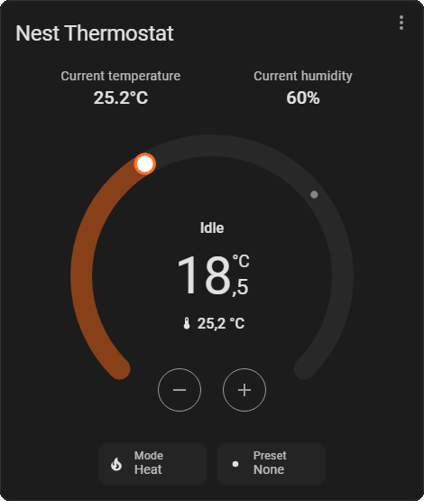

  
 <div align="center">

  [](https://github.com/hacs/integration)
  [](https://www.gnu.org/licenses/agpl-3.0)
  [](https://github.com/rob-vandenberg/chrono-hvac-card/releases)

  

  

  <p align="center">
    <strong>A thermostat card that looks and feels exactly like Home Assistant's own.<br>
            Every button shown or hidden, your way.<br>
            Set up entirely with a visual editor - no YAML needed.</strong>
  </p>

  <p align="center">
    <a href="#introduction">Introduction</a> •
    <a href="#key-features">Key Features</a> •
    <a href="#installation">Installation</a> •
    <a href="#usage">Usage</a> •
    <a href="#license">License</a>
  </p>

</div>

---

**Chrono HVAC Card** is a dashboard card for any `climate` entity. It looks like Home Assistant's built-in thermostat card, because it uses the same real dial component Home Assistant uses internally. On top of that, it adds mode, preset, fan, and swing buttons - and lets you show or hide any part of the card, right from the editor.

---

## 📋 Table of Contents

- [Introduction](#introduction)
- [Key Features](#key-features)
- [Installation](#installation)
  - [HACS (Recommended)](#hacs-recommended)
  - [Manual Installation](#manual-installation)
- [Uninstallation](#uninstallation)
- [Usage](#usage)
  - [Adding the Card](#adding-the-card)
  - [Options](#options)
- [Limitations](#limitations)
- [License](#license)
- [Support](#support)

---

## 🚀 Key Features

### 🎯 Looks and Feels Native
The dial is Home Assistant's own dial component, not a copy. Dragging, stepping, colors, and dual heat/cool ranges all work exactly like the built-in thermostat card.

### 🧩 Capability-Aware Buttons
Mode, preset, fan, and swing buttons only show up if your entity actually supports them. Nothing empty, nothing broken.

### 🎛️ Full Visual Editor
Every setting - the entity, the name, and what's shown or hidden - can be changed from the card editor. No YAML required.

### 👁️ Show or Hide Anything
Turn off the border, the name, the more-info button, the humidity readout, or any of the four mode buttons. Build the exact card you want.

### 📐 Fits Any Dashboard
The card sizes itself to its own content. It works the same in masonry, sections, and panel views, with no layout code needed.

### 🎨 Matches Your Theme
Colors come from your Home Assistant theme automatically, the same way the native card does.

---

## 📦 Installation

### HACS (Recommended)

1. Open **HACS** in your Home Assistant instance.
2. Navigate to **Frontend** and click the three-dot menu in the top right corner.
3. Select **Custom repositories**.
4. Enter `https://github.com/rob-vandenberg/chrono-hvac-card` and select **Lovelace** as the category.
5. Click **Add**. The repository will appear in the list.
6. Search for `Chrono HVAC Card` and click **Download**.
7. Reload your browser.

### Manual Installation

1. Download `chrono-hvac-card.js` from the [latest release](https://github.com/rob-vandenberg/chrono-hvac-card/releases/latest).
2. Copy it to your Home Assistant `config/www/` folder.
3. In Home Assistant, go to **Settings → Dashboards → Resources**.
4. Click **Add Resource**.
5. Enter `/local/chrono-hvac-card.js` as the URL and select **JavaScript Module**.
6. Click **Create** and reload your browser.

---

## 🗑️ Uninstallation

### Via HACS
1. Open **HACS → Frontend**.
2. Find **Chrono HVAC Card** and click the three-dot menu.
3. Select **Remove**.
4. Reload your browser.

### Manual
1. Delete `chrono-hvac-card.js` from `config/www/`.
2. Remove the resource entry from **Settings → Dashboards → Resources**.
3. Remove any cards using `chrono-hvac-card` from your dashboards.

---



---

## ⚙️ Usage

### Adding the Card

1. Open a dashboard and click **Edit Dashboard**.
2. Click **Add Card**.
3. Search for **Chrono HVAC Card**.
4. Pick a `climate` entity from the dropdown.
5. Use the editor to show or hide whatever you want.


The editor only shows toggles that apply to your entity. For example, the Fan mode toggle only appears if your entity has fan modes.

If you'd rather write YAML directly, here's a full example:

```yaml
type: custom:chrono-hvac-card
entity: climate.living_room
name: Living Room
show_entity_name_fallback: true
show_current_temperature: true
show_current_humidity: true
show_more_info_button: false
show_mode_button: true
show_preset_button: true
show_fan_button: true
show_swing_button: true
show_border: true
```

### Options

| Key | Type | Default | What it does |
| :--- | :--- | :--- | :--- |
| `entity` | text | required | The `climate` entity to control. |
| `name` | text | (none) | A custom name to show in the header. Leave it out to use the entity's own name. |
| `show_entity_name_fallback` | `true`/`false` | `true` | If `true` and `name` is empty, shows the entity's friendly name instead. Set to `false` to hide the header entirely when no custom name is set. |
| `show_current_temperature` | `true`/`false` | `true` | Shows the current temperature reading, if the entity reports one. |
| `show_current_humidity` | `true`/`false` | `true` | Shows the current humidity reading, if the entity reports one. |
| `show_more_info_button` | `true`/`false` | `false` | Shows a button in the top-right corner that opens the entity's more-info dialog. |
| `show_mode_button` | `true`/`false` | `true` | Shows the HVAC mode button (heat, cool, auto, off, and so on). |
| `show_preset_button` | `true`/`false` | `true` | Shows the preset mode button, if the entity has presets. |
| `show_fan_button` | `true`/`false` | `true` | Shows the fan mode button, if the entity has fan modes. |
| `show_swing_button` | `true`/`false` | `true` | Shows the swing mode button, if the entity has swing modes. |
| `show_border` | `true`/`false` | `true` | Shows the card's outer border. Set to `false` for a borderless look. |

Using a key that isn't in this list, or a value that isn't valid, won't break the card - it's just ignored.

---

## ⚠️ Limitations

- Only entities from the `climate` domain are supported.
- One entity per card. Add another card for another entity.
- The dial's exact look follows your installed Home Assistant version, since it uses Home Assistant's own dial component directly. A very old Home Assistant version may not have that component available.
- Mode, preset, fan, and swing buttons are only shown if the entity itself reports supporting them. The card can't add capabilities an entity doesn't have.

---

## ⚖️ License

**GNU Affero General Public License v3.0 (AGPL-3.0)**

This project is licensed under the AGPL-3.0. You are free to use, modify, and distribute this software, provided that any modifications or derivative works that are made available — including over a network — are also distributed under the same license.

Full license text: [https://www.gnu.org/licenses/agpl-3.0](https://www.gnu.org/licenses/agpl-3.0)

Copyright © 2026 Rob Vandenberg. All rights reserved.

---

## ☕ Support

If you find this project useful and wish to support its continued development, please consider a contribution.

[](https://www.buymeacoffee.com/robvandenberg)
